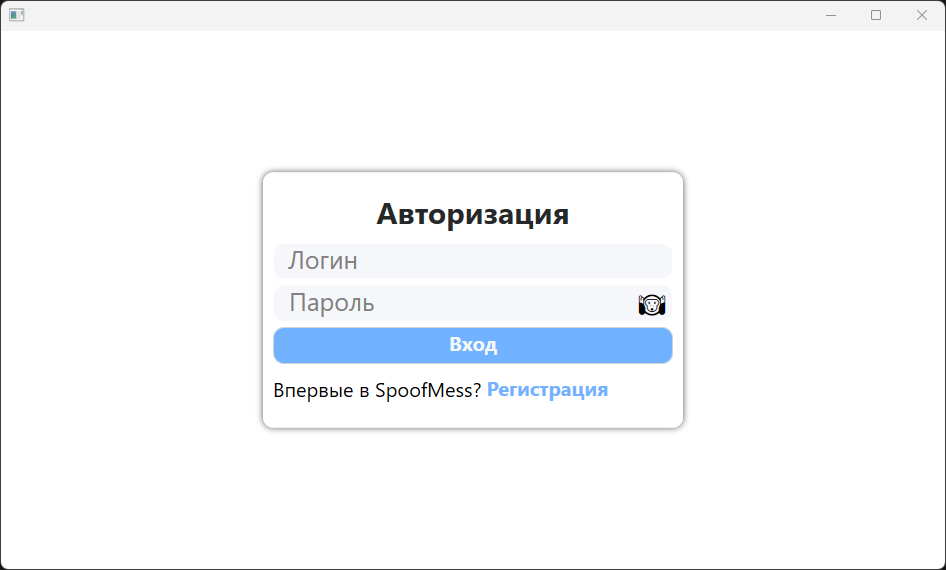
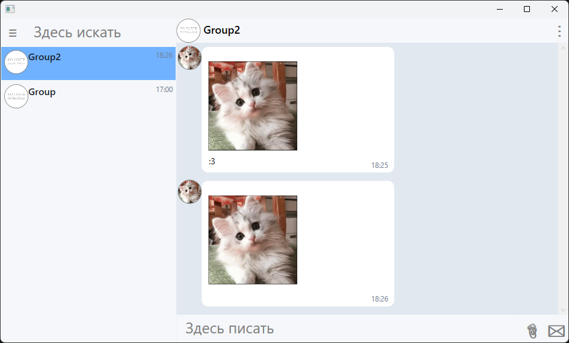

# SpoofMessDesktop
## What is it?
A desktop(Windows) client for [SpoofMess]("https://github.com/Pychka/SpoofMess")
| Authorization View | Main View |
|:---:|:---:|
|  |  |
## Core Features
Now you can:
- Authorize/registration in app;
- Sync your chats + messages;
- Send text messages;
- Attach files;
- See attachments:
    - Images;
    - Music(MP3, WAV, WMA);
    - Other files(now just only their size and name are displayed).

## Roadmap
Soon you can:
- Create your chat types;
- Search chats, messages, users;
- Change settings;
- Upload avatars.

## What stage of project at?
### While on Alpha 0.0.3 Implemented first prototypes of:
- Entry:
    - Registration;
    - Authorization;
    - Auto login at startup;
    - Work with jwt-tokens.
- Sync data after disconnect:
    - Chats;
    - Messages.
- Messaging:
    - send text;
    - send files;
    - see images;
    - listen music;